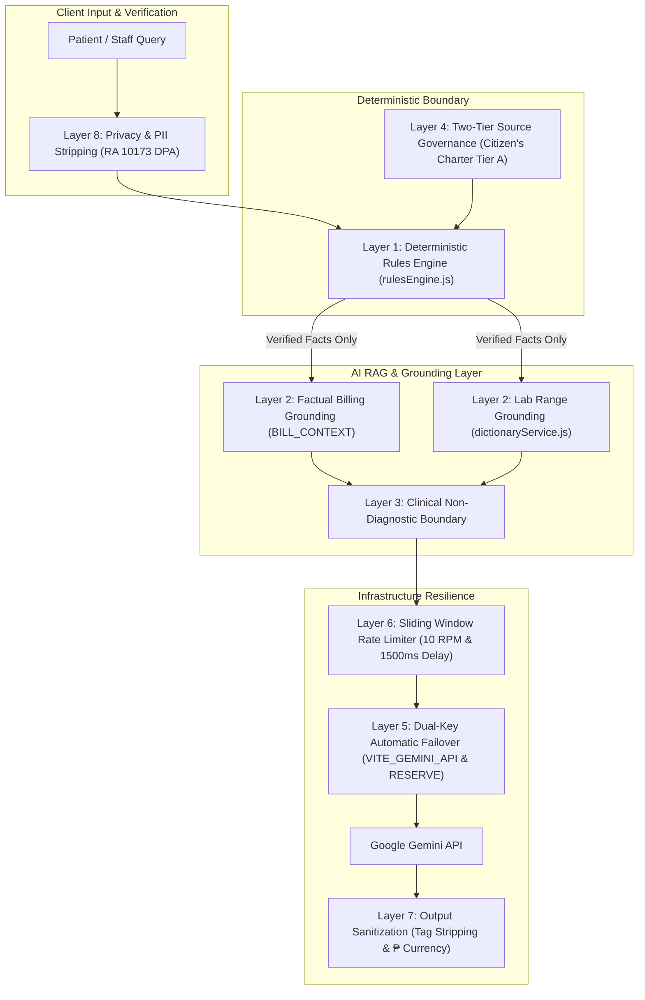

# Alalay AI Guardrails & Safety Engineering Architecture

An in-depth guide to the safety guardrails, anti-hallucination mechanisms, deterministic boundaries, rate limiting, and dual-key failover systems powering the **Alalay Healthcare & Benefits Discovery Platform**.

---

## 1. Executive Summary

Healthcare and government benefit navigation in the Philippines require extreme accuracy, strict data privacy, and zero medical hallucination. In the **Alalay** platform, Generative AI (powered by Google Gemini) is integrated **not as a decision-maker**, but strictly as an **empathetic plain-language translator and grounded guide**.

All financial calculations, benefit eligibility logic, and data privacy boundaries are governed by deterministic JavaScript engines ([`rulesEngine.js`](./src/services/rulesEngine.js)), while strict prompt-level and architectural guardrails sanitize AI inputs and outputs.

---

## 2. The 8 Layers of Alalay AI Guardrails

---

### Layer 1: Deterministic Rules Primacy (Zero AI Decision-Making)
- **Concept**: AI is **never permitted** to decide if a patient is eligible for PhilHealth, DOH MAP, PCSO IMAP, or DSWD AICS assistance.
- **Implementation**: [`rulesEngine.js`](./src/services/rulesEngine.js) evaluates exact Boolean logic (`grossBill`, `philhealth_status`, `indigent_4ps`, `hmo_coverage`) and produces verifiable condition traces (**✓** passed, **✗** pending action).
- **Guardrail Rule**: AI only receives pre-computed condition traces to translate into friendly guidance.

### Layer 2: Factual RAG Grounding (Anti-Hallucination Prompts)
- **Billing Grounding (`BILL_CONTEXT`)**:
  - Restricts AI answers strictly to the 4 verified billing numbers (`GROSS HOSPITAL CHARGES`, `PHILHEALTH DEDUCTION`, `HMO`, `NET AMOUNT PAYABLE`).
  - Prohibits generating non-existent hospital fees or out-of-scope discounts.
- **Laboratory Grounding (`CBC_LAB_CONTEXT`)**:
  - Grounded in authoritative hospital reference ranges from the AI Dictionary ([`dictionaryService.js`](./src/services/dictionaryService.js)).
  - Explicit instruction: *"NEVER fabricate, invent, or hallucinate ranges or units that are not in the dictionary."*

### Layer 3: Clinical Non-Diagnostic Boundary
- **Medical Safety Disclaimer**: The AI is explicitly forbidden from diagnosing diseases, prescribing treatments, or predicting prognoses.
- **Reframing Protocol**: When a lab result is out of range (e.g. White Blood Cells = 12.5 x10^9/L), the AI is instructed:
  > *"DO NOT say 'you have an infection'; explain that high WBC is labeled HIGH based on the hospital reference range and should be discussed with a doctor."*
- Mandatory closing directive: All clinical explanations must direct the user to consult a licensed physician.

### Layer 4: Two-Tier Source Governance (RA 11032 Citizen's Charter)
- **Tier A (Authoritative)**: Citizen's Charters, DOH Orders, and PhilHealth Circulars. Verified and active.
- **Tier B (Unverified Announcements)**: Scraped Facebook posts or submissions flagged as `announced` or `needs_review`.
- **Guardrail Rule**: The AI suppresses unverified Tier B notices from patient feeds until staff complete Tier A verification.

### Layer 5: Dual-Key Automatic Failover Architecture
- **Problem**: Key exhaustion or rate limits (HTTP 401, 403, 429) can crash AI assistant features.
- **Guardrail Solution**: [`geminiService.js`](./src/services/geminiService.js) implements an error interceptor:
  - Detects `401 Unauthorized`, `403 Quota Exceeded`, `429 Rate Limit`, and `RESOURCE_EXHAUSTED`.
  - Automatically switches active execution from Primary Key (`VITE_GEMINI_API`) to Reserve Key (`VITE_GEMINI_API_RESERVE`) seamlessly without failing the user's request.

### Layer 6: API Rate Limiter & Throttling (`GeminiApiLimiter`)
- **Sliding Window RPM Limiter**: Restricts requests to **10 requests per minute** to prevent quota depletion.
- **Min Inter-Request Delay**: Enforces a **1,500ms** pause between consecutive requests.
- **Mutex Queue**: Serializes parallel user requests to eliminate race conditions.
- **Exponential Backoff**: Automatically retries transient network errors.

### Layer 7: Output Sanitization & Formatting (`cleanMarkdownText`)
- Strips complex nested markdown tags (`**`, `*`) that cause visual clutter on mobile screens.
- Standardizes list items to clean bullet points (`• `) and formats all currency values in Philippine Pesos (`₱`).

### Layer 8: Data Privacy & Consent Boundary (RA 10173 DPA)
- **Minimal Fact Transmission**: Prompts transmitted to Gemini contain zero direct Patient Identifiable Information (PII) such as full street address or Government ID numbers.

---

## 3. Web Scraper Function Integration

The **Alalay Web Scraper** ([`facebookScraper.js`](./src/services/facebookScraper.js)) operates with safety safeguards:
- **Cheerio HTML Parser**: Extracts Open Graph, JSON-LD, and public advisory content.
- **SHA-256 Content Hashing**: Generates unique fingerprint hashes to prevent duplicate ingestion.
- **Allowlist Safeguards (`INGESTION_ALLOWLIST`)**: Restricts scraping strictly to verified official health institutions (VSMMC, UP-PGH, DOH, Lung Center, NKTI, PhilHealth, PCSO, DSWD).
- **Automated Sync Pipeline (`runFacebookSyncPipeline`)**: Ingests, normalizes, and classifies new advisories into Tier B for admin review.
