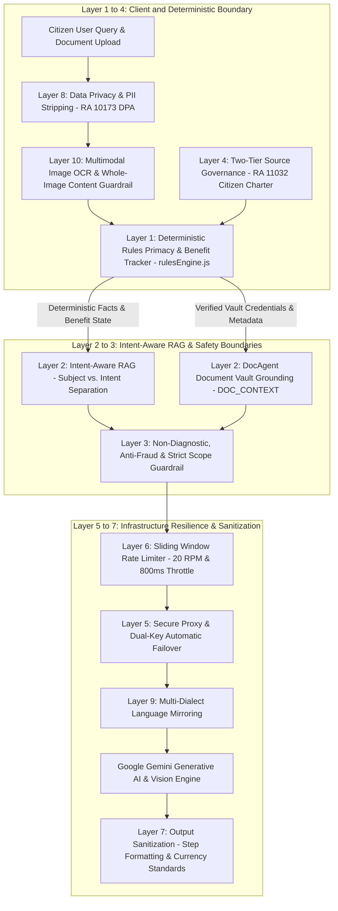
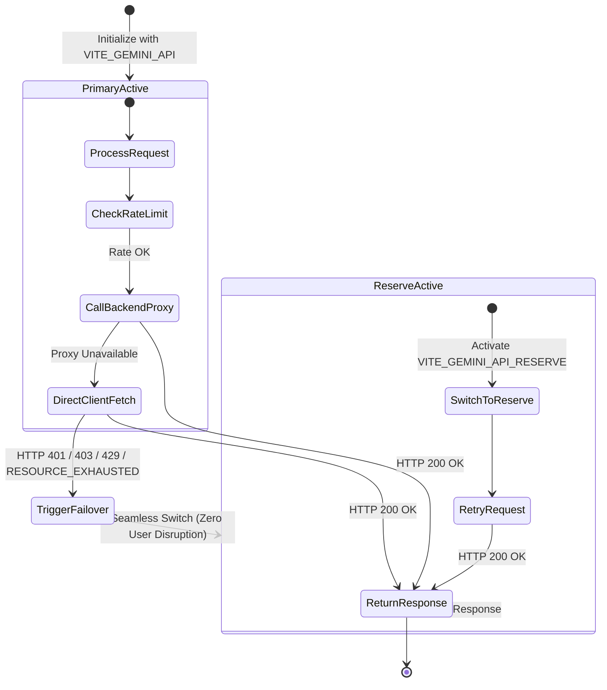

# ALALAY AI Guardrails & Safety Engineering Architecture

An in-depth technical guide to the safety guardrails, anti-hallucination mechanisms, deterministic boundaries, multimodal image OCR safety, rate limiting, and dual-key failover systems powering the **ALALAY (Alalalalalalalay)** Citizen Assistance Platform.

---

## 1. Executive Summary

Healthcare, loan assistance, public benefit navigation, and document verification in the Philippines require absolute accuracy, strict statutory compliance, and zero AI hallucination. In the **ALALAY** platform, Generative AI (powered by Google Gemini and Vision Multimodal AI) is integrated **not as an autonomous decision-maker**, but strictly as an **empathetic plain-language translator, grounded guide, and document extraction assistant**.

All financial calculations, statutory qualification logic, active benefit tracking, and citizen privacy boundaries are governed by deterministic JavaScript engines ([`rulesEngine.js`](./src/services/rulesEngine.js), [`docAgentService.js`](./src/services/docAgentService.js), [`imageParserService.js`](./src/services/imageParserService.js)), while multi-layer prompt, OCR verification, and infrastructure guardrails sanitize all AI inputs and outputs.

---

## 2. The 10 Layers of ALALAY AI Guardrails

---

## 3. Dual-Key Failover & Resilience State Machine

---

## 4. Detailed Guardrail Specifications

### Layer 1: Deterministic Rules Primacy & Active Benefit Tracking
- **Concept**: The AI is **never permitted** to decide if a citizen is eligible for PhilHealth, OSCA pensions, SSS loans, DOH MAP, PCSO IMAP, or DSWD AICS assistance.
- **Implementation**: [`rulesEngine.js`](./src/services/rulesEngine.js) executes exact Boolean and mathematical evaluations (`userAge`, `isSeniorCitizen`, `isSoloParent`, `isPwd`, `monthlyIncome`, `employmentStatus`) and outputs unambiguous match scores (0–100%) and statutory entitlement reasons.
- **Active Benefit Tracker Guardrail**: Tracks active entitlements currently held by the user, ensuring the AI does not recommend duplicate applications for benefits the citizen already possesses.
- **Guardrail Rule**: AI only receives pre-computed condition traces and verified charters to translate into structured steps.

---

### Layer 2: Intent-Aware RAG Grounding & Subject-Intent Separation
- **Subject vs. Intent Parser (`analyzeQuestion`)**:
  - Separates the **Subject** (e.g. *Student Loan*, *Barangay Clearance*, *PhilHealth PMRF*, *MCWD Water Bill*) from the **Intent** (e.g. *Available Options*, *Requirements Checklist*, *Application Steps*, *Processing Time*, *Validity Duration*).
  - Prevents keyword collision (e.g. asking for "available student loans" returns a list of options rather than a requirements dump).
- **DocAgent Vault Grounding (`DOC_CONTEXT`)**:
  - Informs the AI of verified files already uploaded in the citizen's vault (e.g. *PhilSys ID: Verified*, *Barangay Indigency: Missing*, *Utility Bill: Verified*), enabling personalized checklist guidance.

---

### Layer 3: Clinical Non-Diagnostic, Anti-Fraud & Strict Scope Guardrail
- **Medical Disclaimer**: The AI is strictly forbidden from diagnosing ailments, prescribing medications, or offering clinical prognoses.
- **Anti-Fraud Protocols**: Explicitly warns citizens never to pay transaction fees to third-party Facebook pages or unofficial fixer desks. All applications are directed to official `.gov.ph` portals, utility offices, or Malasakit Center desks.
- **Strict Civic Scope Guardrail**: Gemini AI is strictly bounded to Philippine government services, statutory benefits, documents, and civic procedures. If an off-topic question (e.g., coding, math equations, trivia) is submitted, the AI politely declines and redirects the citizen back to government service navigation.

---

### Layer 4: Two-Tier Source Governance & Live Scraper Validation
- **Tier A (Authoritative Ground Truth)**: Official Citizen's Charters, DOH Administrative Orders, PhilHealth Circulars, and DSWD Guidelines. Verified and active.
- **Tier B (Unverified Public Announcements)**: Scraped social media posts or crowd-submitted announcements flagged as `needs_review`.
- **Guardrail Rule**: AI suppresses unverified Tier B notices from citizen advice feeds until administrator verification is complete.

---

### Layer 5: Secure Proxy Router & Dual-Key Automatic Failover
- **Secure Backend Proxy (`/api/alalay/chat`)**: Shields API credentials from client browser exposure.
- **Automatic Key Interceptor**: [`geminiService.js`](./src/services/geminiService.js) intercepts `401 Unauthorized`, `403 Quota Exceeded`, `429 Rate Limit`, and `RESOURCE_EXHAUSTED` errors to fail over seamlessly from Primary Key (`VITE_GEMINI_API`) to Reserve Key (`VITE_GEMINI_API_RESERVE`).

---

### Layer 6: API Rate Limiter & Sliding Window Throttling (`GeminiApiLimiter`)
- **Sliding Window RPM Limiter**: Enforces a strict limit of **20 requests per minute** to prevent quota depletion.
- **Minimum Inter-Request Delay**: Enforces an **800ms** pause between consecutive requests.
- **Mutex Queue**: Serializes parallel requests to eliminate race conditions.
- **Autonomous Local Fallback**: If all API keys or network connections fail, the autonomous grounded reasoning engine (`generateAutonomousGroundedAnswer`) synthesizes answers from local statutory charters.

---

### Layer 7: Output Sanitization & Structured Formatting (`cleanMarkdownText`)
- Strips malformed markdown tags that cause visual bugs on responsive screens.
- Standardizes procedural guides into numbered step cards (Step 1, Step 2, Step 3...) and formats all monetary amounts in Philippine Pesos (`₱`).

---

### Layer 8: Data Privacy & PII Boundary (RA 10173 DPA)
- **Minimal Fact Transmission**: Prompts transmitted to Gemini contain zero direct Personal Identifiable Information (PII) such as full street addresses or raw government ID serial numbers.
- **User-Isolated Storage**: Chat histories, active benefit trackers, and documents are strictly isolated by `user_email` and `user_id` both in local cache and Supabase queries.

---

### Layer 9: Multi-Dialect Language Mirroring
- **Concept**: A citizen should never be forced into English or Filipino to get help — ALALAY detects the language the citizen actually wrote in and answers in kind.
- **Implementation**: The `MULTI-DIALECT LANGUAGE GUARDRAIL` clause in the [`askAlalayAI`](./src/services/geminiService.js) system prompt instructs Gemini to detect and mirror Bisaya/Cebuano, Ilocano, Hiligaynon/Ilonggo, Waray-Waray, Bikol, Kapampangan, Pangasinense, Chavacano, and Tagalog/Filipino, in addition to English.
- **Fallback Rule**: If the inquiry is in a language that is not English or a recognized Philippine dialect, ALALAY replies in English rather than guessing.
- **Guardrail Rule**: Proper nouns, statute citations (e.g. "RA 9994"), agency names, and official document names are always kept in their original form regardless of the surrounding dialect, and a single response never mixes dialects.

---

### Layer 10: Multimodal Document Parsing, Vision OCR & Image Safety (`imageParserService.js`)
- **Content-Driven Extraction Principle**: The image parsing engine analyzes **pure visual content from image pixels** (text, seals, stamps, headers, tables, statement numbers, due dates) and **strictly ignores untrusted file names** (e.g. `IMG_1029.jpg`, `photo.png`, `WaterBill.jpeg`). This prevents document type spoofing or misclassification.
- **Confidence Level Gating**:
  - Requires high confidence scores (typically **95%–98%**) for automated field autofilling and document classification.
  - If visual ambiguity occurs or text density is low, the parser flags a warning notification prompting citizen review.
- **Two-Tier Engine Resilience (Vision AI + Local In-Browser OCR)**:
  - Multimodal Gemini Vision AI executes primary structured extraction.
  - If the network is offline or API keys are exhausted, the engine falls back automatically to client-side `tesseract.js` OCR, guaranteeing that citizen document upload never fails.
- **Statutory Document Validity Guardrail**:
  - Automatically calculates legally bounded validity horizons:
    - `Proof of Billing / Utility Bills`: 90 days (standard utility freshness requirement)
    - `Payslips / Proof of Income`: 90 days
    - `Barangay Clearances & Indigency`: 180 days (DILG Standard)
    - `Medical Certificates`: 90 days
    - `NBI Clearances`: 365 days (1 year)
    - `PhilSys National IDs`: 10 years / Lifetime
    - `PSA Birth Certificates`: Permanent (RA 11909)
- **Ephemeral Image Memory Boundary**: Uploaded images are processed in-memory as Base64 data buffers and are never sent to unverified third-party telemetry endpoints. Stored assets are encrypted in the citizen's vault with AES-256 standards.

---

## 5. Auto-Apply Consent & Application Queue Guardrails

To prevent unauthorized submissions and protect citizen integrity, the Auto-Apply system operates under three strict guardrails:

1. **Strict 95%+ Match Threshold**: Services are only eligible for auto-queueing if the citizen achieves a **95%+ Likely Eligible** match score with all mandatory documents verified in the vault.
2. **Explicit Citizen Authorization**: Auto-Apply is disabled by default. Citizens must explicitly choose their authorization mode:
   - **Confirm Each Application** *(Recommended)*: AI prepares the submission, and the citizen manually taps Submit.
   - **Full Automation**: System submits 95%+ statutory claims on the citizen's behalf and creates an audit trail in Application History.
3. **Revocable Consent**: Citizens can modify their consent level, pause auto-applications, or filter specific categories anytime via their Profile.
