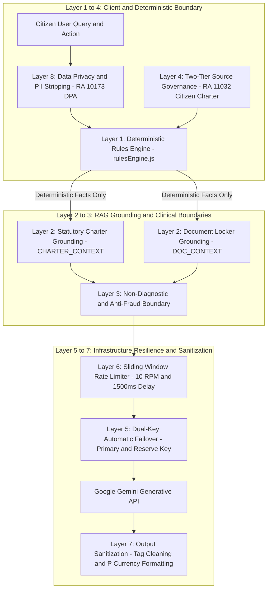
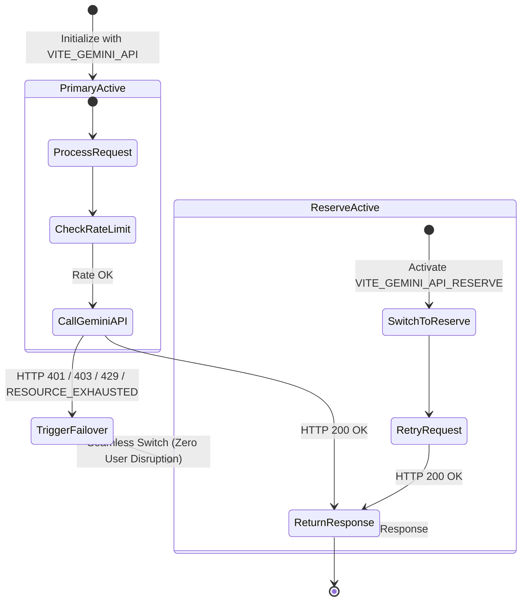

# ALALAY AI Guardrails & Safety Engineering Architecture

An in-depth guide to the safety guardrails, anti-hallucination mechanisms, deterministic boundaries, rate limiting, and dual-key failover systems powering the **ALALAY (Alalalalalalalay)** Citizen Assistance Platform.

---

## 1. Executive Summary

Healthcare, loan assistance, and public benefit navigation in the Philippines require absolute accuracy, strict statutory compliance, and zero AI hallucination. In the **ALALAY** platform, Generative AI (powered by Google Gemini) is integrated **not as an autonomous decision-maker**, but strictly as an **empathetic plain-language translator and grounded guide**.

All financial calculations, statutory qualification logic, and citizen privacy boundaries are governed by deterministic JavaScript engines ([`rulesEngine.js`](./src/services/rulesEngine.js)), while multi-layer prompt and infrastructure guardrails sanitize all AI inputs and outputs.

---

## 2. The 8 Layers of ALALAY AI Guardrails

---

## 3. Dual-Key Failover & Resilience State Machine

---

## 4. Detailed Guardrail Specifications

### Layer 1: Deterministic Rules Primacy (Zero AI Decision-Making)
- **Concept**: The AI is **never permitted** to decide if a citizen is eligible for PhilHealth, OSCA pensions, SSS loans, DOH MAP, PCSO IMAP, or DSWD AICS assistance.
- **Implementation**: [`rulesEngine.js`](./src/services/rulesEngine.js) executes exact Boolean and mathematical evaluations (`userAge`, `isSeniorCitizen`, `isSoloParent`, `isPwd`, `monthlyIncome`, `employmentStatus`) and outputs unambiguous match scores and statutory reasons.
- **Guardrail Rule**: AI only receives pre-computed condition traces and verified charters to translate into structured steps.

### Layer 2: Factual RAG Grounding (Anti-Hallucination Prompts)
- **Charter Grounding (`CHARTER_CONTEXT`)**:
  - Restricts AI answers strictly to verified government Citizen's Charters and statutory circulars.
  - Prohibits generating non-existent benefits, arbitrary cash grants, or unauthorized contact information.
- **Document Locker Grounding (`DOC_CONTEXT`)**:
  - Informs the AI of verified files already uploaded in the citizen's vault (e.g. *PhilSys ID: Verified*, *Barangay Indigency: Missing*).

### Layer 3: Clinical Non-Diagnostic & Anti-Fraud Boundary
- **Medical Disclaimer**: The AI is strictly forbidden from diagnosing ailments, prescribing medications, or offering clinical prognoses.
- **Anti-Fraud Protocols**: Explicitly warns citizens never to pay transaction fees to third-party Facebook pages or unofficial fixer desks. All applications are directed to official `.gov.ph` portals or Malasakit Center desks.

### Layer 4: Two-Tier Source Governance (RA 11032 Citizen's Charter)
- **Tier A (Authoritative)**: Official Citizen's Charters, DOH Administrative Orders, PhilHealth Circulars, and DSWD Guidelines. Verified and active.
- **Tier B (Unverified Announcements)**: Scraped social media posts or crowd-submitted announcements flagged as `needs_review`.
- **Guardrail Rule**: AI suppresses unverified Tier B notices from citizen advice feeds until administrator verification is complete.

### Layer 5: Dual-Key Automatic Failover Architecture
- **Problem**: API key depletion or quota limits (HTTP 401, 403, 429) can crash AI assistant features.
- **Solution**: [`geminiService.js`](./src/services/geminiService.js) implements an error interceptor:
  - Detects `401 Unauthorized`, `403 Quota Exceeded`, `429 Rate Limit`, and `RESOURCE_EXHAUSTED`.
  - Automatically switches active execution from Primary Key (`VITE_GEMINI_API`) to Reserve Key (`VITE_GEMINI_API_RESERVE`) seamlessly without failing the citizen's request.

### Layer 6: API Rate Limiter & Throttling (`GeminiApiLimiter`)
- **Sliding Window RPM Limiter**: Enforces a strict limit of **10 requests per minute** to prevent quota depletion.
- **Minimum Inter-Request Delay**: Enforces a **1,500ms** pause between consecutive requests.
- **Mutex Queue**: Serializes parallel requests to eliminate race conditions.
- **Exponential Backoff**: Automatically retries transient network interruptions.

### Layer 7: Output Sanitization & Formatting (`cleanMarkdownText`)
- Strips malformed markdown tags that cause visual bugs on responsive screens.
- Standardizes procedural guides into numbered step cards and formats all monetary amounts in Philippine Pesos (`₱`).

### Layer 8: Data Privacy & PII Boundary (RA 10173 DPA)
- **Minimal Fact Transmission**: Prompts transmitted to Gemini contain zero direct Personal Identifiable Information (PII) such as full street addresses or raw government ID serial numbers.
- **User-Isolated Storage**: Chat histories and documents are strictly isolated by `user_email` and `user_id` both in local cache and Supabase queries.
