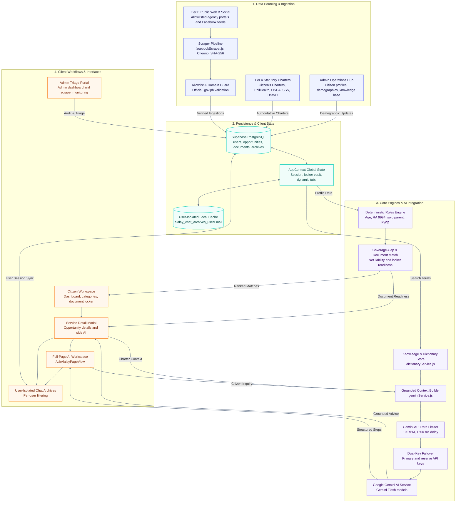

# ALALAY System Architecture & Engineering Blueprint

The **ALALAY (Alalalalalalalay)** platform is an intelligent Philippine Citizen Assistance, Statutory Benefits Discovery, and Government Service Navigation system. It connects verified Citizen's Charters with citizen demographic profiles through a multi-factor deterministic matching engine, automated scrapers, a secure Document Locker vault, and grounded Gemini Generative AI.

---

## 1. System Architecture Flowchart

---

## 2. Layer-by-Layer Architecture Details

### 2.1 Layer 1: Data Sourcing & Ingestion
- **Admin Operations Hub (`AdminDashboard.jsx`)**: Registers citizen profiles with **Date of Birth (`birth_date`)**, **Citizenship**, PWD, Solo Parent, and employment status. Also manages the official Citizen's Charter knowledge base.
- **Tier A Statutory Sources (`Citizen's Charters, DOH, PhilHealth, OSCA, SSS, DSWD, CHED/UniFAST`)**: Authoritative statutory ground truths that define exact requirements, benefit caps, and application desk locations.
- **Tier B Public Web & Social (`Agency Portals & Facebook Feeds`)**: Real-time government agency announcements scraped via [`facebookScraper.js`](./src/services/facebookScraper.js) with Cheerio parsing and SHA-256 content hashing.
- **Allowlist & Domain Guard**: Strictly validates that ingested data originates from official `.gov.ph` domains or verified public agency channels.

---

### 2.2 Layer 2: Persistence & Client State
- **Supabase Cloud PostgreSQL DB**: Stores structured tables (`users`, `opportunities`, `user_documents`, `chat_archives`, `scraping_logs`) secured by Row-Level Security (RLS).
- **User-Isolated Local Cache**: Implements partitioned browser storage keys (`alalay_chat_archives_${userEmail}`) to ensure instant retrieval and multi-user data isolation.
- **Client Global State (`AppContext.jsx`)**: Centralized reactive state managing citizen authentication, dynamic tabs, Document Locker, live opportunity ranking, and active consultation sessions.

---

### 2.3 Layer 3: Core Engines & AI Integration
- **Multi-Factor Deterministic Rules Engine (`rulesEngine.js`)**: Evaluates Boolean and mathematical eligibility rules for Senior Citizens (RA 9994 / RA 10645), Solo Parents (RA 11861), PWDs (RA 10754), salary loan contributions, and indigent safety nets (**DOH MAP / DSWD AICS**). **AI never calculates financial numbers.**
- **Coverage-Gap & Document Match Evaluator**: Dynamically cross-references the citizen's Document Locker with service requirements to generate match scores (0–99%), demographic badges, and exact document readiness percentages (`docReadinessPercent`).
- **Knowledge & Dictionary Store (`dictionaryService.js`)**: Provides localized dictionary lookups and semantic charter search.
- **Grounded Context Builder (`geminiService.js`)**: Synthesizes verified statutory charter excerpts, citizen demographics, and document readiness into grounded AI prompts.
- **Gemini API Rate Limiter (`GeminiApiLimiter`)**: Enforces a strict sliding window of **10 requests per minute** and a **1,500ms delay** between requests to prevent quota depletion.
- **Dual-Key Automatic Failover**: Automatically intercepts HTTP 401, 403, 429, and `RESOURCE_EXHAUSTED` errors to fail over from Primary Key (`VITE_GEMINI_API`) to Reserve Key (`VITE_GEMINI_API_RESERVE`).
- **Google Gemini AI Service**: Generates structured, empathetic procedural guides formatted with numbered steps, requirement checklists, and `.gov.ph` citation badges.

---

### 2.4 Layer 4: Client Workflows & Interactive Interfaces
- **Citizen Workspace (`HomeDashboard.jsx` & `ExploreCategories.jsx`)**: Displays ranked opportunities with demographic match tags, match percentages, and Document Locker readiness badges.
- **Dedicated Full-Page AI Workspace (`AskAlalayPageView.jsx`)**: Full-screen workspace with fixed card bounds, pinned header, independently scrolling middle conversation stream, and pinned bottom input island.
- **3 : 1 Dual-Card Service Detail Modal (`OpportunityDetailModal.jsx`)**: Responsive dual-card interface with smooth slide animation, sticky headers/action footers, and live side AI chat.
- **User-Isolated Chat Archives (`ChatArchivesView.jsx`)**: Displays exclusively the signed-in citizen's previous AI consultations with 1-click resumption.
- **Admin Triage & Operations Hub (`AdminDashboard.jsx`)**: Features a fixed, non-scrolling sticky sidebar (`h-screen sticky top-0`) for navigation, user management, and live scraping monitors.
