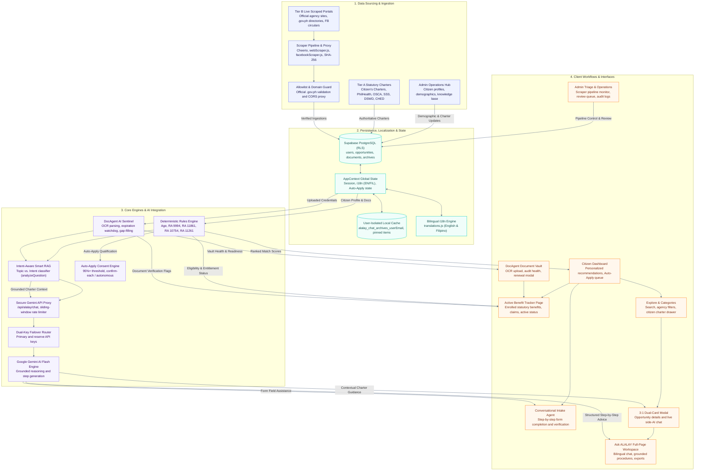
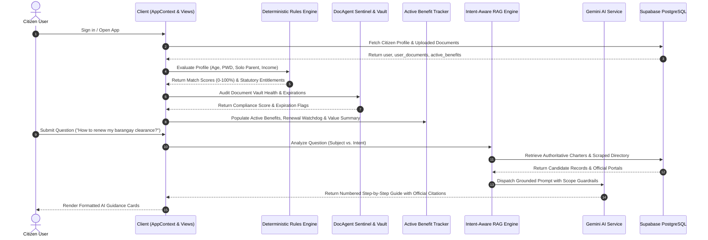

# ALALAY System Architecture & Engineering Blueprint

The **ALALAY (Alalalalalalalay)** platform is an intelligent Philippine Citizen Assistance, Statutory Benefits Discovery, and Government Service Navigation system. It connects verified Citizen's Charters with citizen demographic profiles through a multi-factor deterministic matching engine, automated scrapers, a secure DocAgent Document Vault, an Active Benefit Tracker, and grounded Google Gemini Generative AI.

---

## 1. System Architecture Flowchart

---

## 2. Layer-by-Layer Architecture Details

### 2.1 Layer 1: Data Sourcing & Ingestion
- **Admin Operations Hub (`AdminDashboard.jsx`)**: Central hub for registering citizen profiles with **Date of Birth (`birth_date`)**, **Citizenship**, PWD, Solo Parent, and employment status. Also manages the official Citizen's Charter knowledge base and scraping schedules.
- **Tier A Statutory Sources (`Citizen's Charters, DOH, PhilHealth, OSCA, SSS, DSWD, CHED/UniFAST, DOLE, TESDA`)**: Authoritative statutory ground truths that define exact requirements, benefit caps, and application desk locations.
- **Tier B Public Web & Live Scrapers (`webScraper.js`, `facebookScraper.js`)**: Real-time government agency announcements scraped with Cheerio parsing, metadata extraction, and SHA-256 deduplication hashing.
- **Official Agency Directory & Allowlist Guard**: Strictly validates that all crawled content originates from official `.gov.ph` domains and verified agency portals, passing through a dedicated Vite proxy to overcome browser CORS limitations.

---

### 2.2 Layer 2: Persistence, Localization & Client State
- **Supabase Cloud PostgreSQL DB**: Stores structured entities (`users`, `opportunities`, `user_documents`, `chat_archives`, `scraping_logs`) secured with Row-Level Security (RLS) policies.
- **User-Isolated Local Cache**: Implements partitioned browser storage keys (`alalay_chat_archives_${userEmail}`) ensuring instant retrieval and complete multi-user privacy isolation.
- **Global Application Context (`AppContext.jsx`)**: Centralized reactive state managing citizen authentication, active tab routing, Document Locker, live opportunity ranking, and active consultation sessions.
- **Bilingual i18n Localization Engine (`translations.js`)**: Real-time dynamic language switcher supporting both **English** and **Filipino (Tagalog)** across all navigation, dashboard, document vault, profile, and UI elements.

---

### 2.3 Layer 3: Core Engines & AI Integration
- **Multi-Factor Deterministic Rules Engine (`rulesEngine.js`)**: Evaluates exact Boolean and mathematical eligibility rules for Senior Citizens (RA 9994 / RA 10645), Solo Parents (RA 11861), PWDs (RA 10754), First-Time Jobseekers (RA 11261), salary loan contributions, and indigent safety nets (**DOH MAP / DSWD AICS**). **AI never calculates financial amounts or eligibility decisions.**
- **Intent-Aware Smart RAG Retriever (`geminiService.js`)**: Deconstructs citizen inquiries by separating the **Subject** (program/benefit/agency) from the **Intent** (available options, requirements, eligibility, application steps, fees, processing time, validity duration). Eliminates keyword collision errors.
- **DocAgent AI Document Sentinel (`docAgentService.js`)**: Autonomous OCR parser, expiration watchdog, and compliance health auditor. Proactively detects expiring IDs, clearances, and medical abstracts, offering 1-click renewal workflows.
- **Auto-Apply Consent & Queue Engine**: Evaluates citizen readiness against a strict 95%+ "Likely Eligible" bar. Operates in two user-authorized consent modes:
  - *Confirm Each Application* (Citizen reviews prepared forms and taps Submit).
  - *Full Automation* (System submits verified statutory claims automatically and notifies the user).
- **Secure Gemini API Proxy & Rate Limiter**: Encapsulates API tokens within a secure backend endpoint (`/api/alalay/chat`) with client direct fallback. Features a sliding-window rate limiter (20 RPM) and inter-request throttle delay (800ms).
- **Dual-Key Automatic Failover Router**: Automatically switches execution from Primary Key (`VITE_GEMINI_API`) to Reserve Key (`VITE_GEMINI_API_RESERVE`) upon encountering 401, 403, 429, or `RESOURCE_EXHAUSTED` responses.
- **Google Gemini Generative AI Service**: Produces structured, empathetic procedural guides formatted with numbered steps, requirement checklists, and `.gov.ph` citation badges.

---

### 2.4 Layer 4: Client Workflows & Interactive Interfaces

- **Citizen Home Dashboard (`HomeDashboard.jsx`)**: Displays prioritized opportunity feeds, Senior Citizen Mode entitlements, recommended services, and Auto-Apply queue status.
- **Active Benefit Tracker (`BenefitTrackerView.jsx` / Benefit Tracker Page)**:
  - **Comprehensive Benefit Dashboard**: Dedicated screen displaying all public benefits, statutory entitlements, and welfare programs that the citizen currently holds or has actively unlocked.
  - **Live Status & Expiration Watchdog**: Tracks active coverage status, validity windows, renewal dates, and annual re-certification requirements (e.g. OSCA social pension disbursement periods, PhilHealth Konsulta validity, PWD ID validity, SSS loan amortization schedules).
  - **Document Vault Linkage**: Cross-references held benefits with supporting vault documents, flagging any missing prerequisites required to maintain active benefit status.
  - **Entitlement Value Summary**: Aggregates statutory discount privileges (20% discount + 12% VAT exemption, free tuition under RA 10931, PhilHealth Zero-Balance Billing).
- **Explore & Categorized Services (`ExploreCategories.jsx`)**: Searchable index of verified Philippine public services with agency filters (PhilHealth, SSS, CHED, DOH, DSWD, OSCA) and Citizen's Charter drawer.
- **DocAgent Document Vault (`DocumentsView.jsx` & `DocAgentRenewalModal.jsx`)**: AES-256 encrypted digital locker with autonomous OCR ingestion, compliance score meter, and step-by-step renewal modal.
- **Conversational Application Intake Agent (`ApplicationIntakeAgent.jsx`)**: Interactive AI-assisted application intake assistant guiding citizens through form field completion, document validation, and submission preparation.
- **Dedicated Full-Page AI Workspace (`AskAlalayPageView.jsx`)**: Full-screen workspace with fixed card bounds, pinned header, independently scrolling middle conversation stream, and pinned bottom input island.
- **3 : 1 Dual-Card Service Detail Modal (`OpportunityDetailModal.jsx`)**: Responsive dual-card interface with smooth slide animation, sticky headers/action footers, and live side AI chat.
- **User-Isolated Chat Archives (`ChatArchivesView.jsx`)**: Displays exclusively the signed-in citizen's previous AI consultations with 1-click resumption.
- **Admin Triage & Operations Hub (`AdminDashboard.jsx`)**: Features a fixed, non-scrolling sticky sidebar (`h-screen sticky top-0`) for navigation, user management, live scraping monitors, and AI review queues.

---

## 3. Data Flow & Execution Sequence

---

## 4. Architectural Principles & Guarantees

1. **Deterministic Primacy**: All eligibility evaluations, match percentages, and benefit amounts are computed deterministically. AI never decides eligibility.
2. **Intent-Separated RAG**: Retrieval is filtered by both subject and query intent to prevent keyword collisions.
3. **Continuous Benefit Tracking**: The Active Benefit Tracker maintains real-time visibility into citizen entitlements, preventing lapse of coverage.
4. **Proactive Document Sentinel**: DocAgent monitors expirations and auto-verifies vault documents against agency requirements.
5. **Strict Scope Guardrails**: Gemini AI is strictly bounded to Philippine government services and citizen welfare, rejecting off-topic queries.
6. **Zero Disruption Resilience**: Dual-key failover, sliding-window rate limiting, and local grounded reasoning fallbacks guarantee 99.9% uptime.
